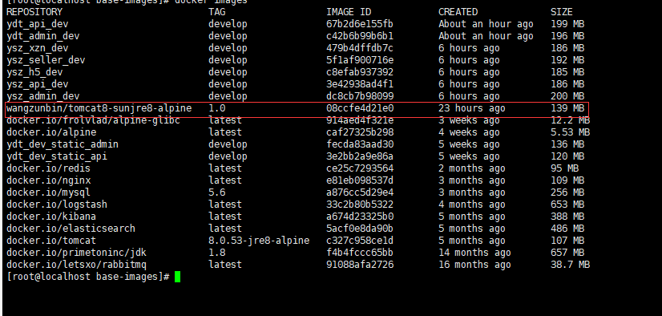

# docker基础镜像制作和推送
需求: 由于java里面使用的是orcle jdk的字体, Openjdk没有此字体

#### docker基础镜像-系统篇

	> Oracle的JRE依赖于glibc, 所以详细讲解请看[如何创建一个安全的Docker基镜像](http://dockone.io/article/1130)
	> 我找到基础镜像为[docker-alpine-glibc](https://github.com/frol/docker-alpine-glibc)
	>你可以在本地docker服务里面使用, 参照上面的github里面的命令行: docker pull frolvlad/alpine-glibc
	

#### docker基础镜像准备-准备资料
	
	参考资料:
[Docker容器之最小JDK基础镜像](https://cloud.tencent.com/developer/article/1188404)

	> 由于sun的jdk比较大,我们需要裁掉一些不需要的文件, 只剩下jre就ok了
	> 具体操作已经放在附件的Dockerfiles里面

#### dockerfile文件的讲解

	#来自哪个基础镜像
	FROM docker.io/frolvlad/alpine-glibc:latest
	#指定谁维护	
	MAINTAINER wangzunbin <905192187@qq.com>
	
	#创建jdk目录
	RUN mkdir -p /usr/java/jdk
	#创建tomcat目录
	RUN mkdir -p /usr/local/tomcat
	
	#把宿主当前目录下的jdk文件夹添加到镜像
	ADD jre8 /usr/java/jdk
	#把宿主当前目录下的tomcat文件夹添加到镜像
	ADD tomcat8 /usr/local/tomcat
	
	# set env
	ENV JAVA_HOME /usr/java/jdk
	# ENV PATH ${PATH}:${JAVA_HOME}/bin
	ENV CATALINA_HOME /usr/local/tomcat
	ENV PATH $PATH:$JAVA_HOME/bin:$CATALINA_HOME/bin
	
	# run container with base path:/opt
	# WORKDIR /opt
	>注意: 构建基础镜像不需要启动起来, 但是要启动起来的话也是验证这个镜像是否ok, 如果测试过来的话要把运行起来的代码注释掉,如上面的# WORKDIR /opt

#### docker构建基础镜像

	参考资料
[Docker容器之最小JDK基础镜像](https://cloud.tencent.com/developer/article/1188404)	

	构建之前确保Dockerfiles的所有文件都在一级目录
	docker build -t wangzunbin/tomcat8-sunjre8-alpine:1.0 .
		构建参数讲解: -t --- 略过
					wangzunbin/tomcat8-sunjre8-alpine:1.0 --- (这个随便,但是我要上传到dockerhub,必须安装它的格式来命令),后面的是1.0是版本号
					. --- 构建当前的目录下所有文件

构建成功之后的基础镜像为下图:
  

#### docker推送基础镜像到docker hub
	
	参考资料
[如何将docker 镜像上传到docker hub仓库](https://blog.csdn.net/chengly0129/article/details/70211132)

完毕!!!!

参考资料如下:

[alpine_glibc 构建sun jdk 8的docker镜像](https://my.oschina.net/ytqvip/blog/1595054)

[在sun jdk 8镜像基础上构建tomcat 8 docker镜像](https://my.oschina.net/ytqvip/blog/1595076)

[Docker容器学习梳理--日常操作总结-------强烈推荐](https://www.cnblogs.com/kevingrace/p/5715326.html)