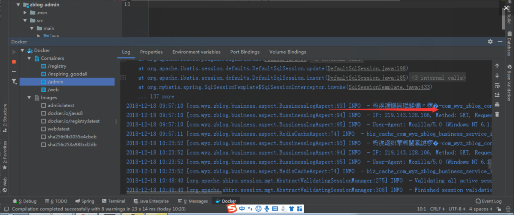
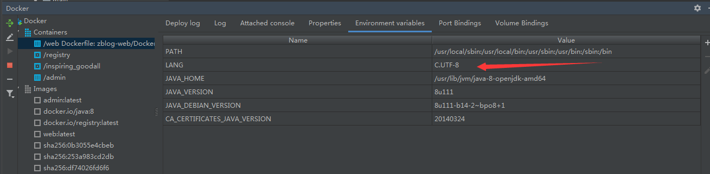
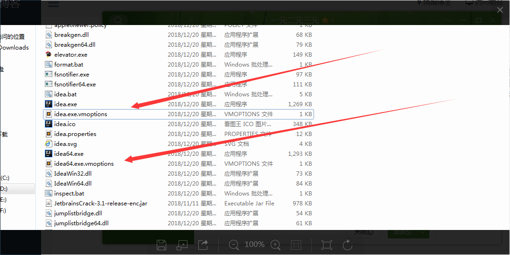
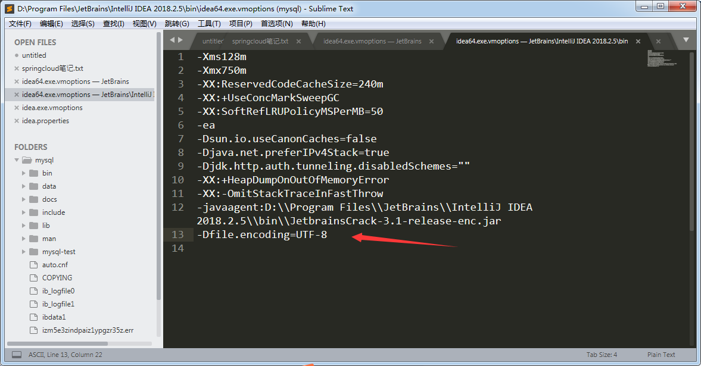
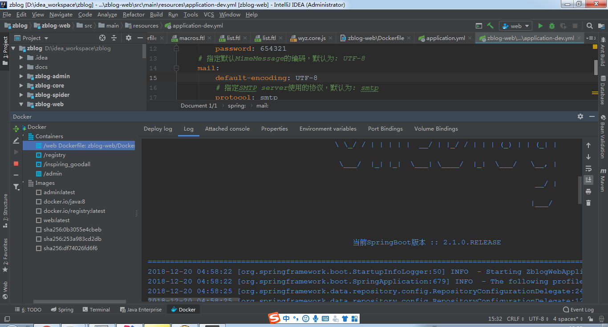

##  docker常见问题

#### 1.IDEA docker控制台中文乱码的解决方式

	参考: 
[IDEA docker控制台中文乱码的解决方式](https://wangyaozheng.top/article/21)

	问题如下图:
  

	解决方法:
	查看其环境配置语言是否是C.UTF-8
  
	可是还是有乱码，查看IDEA file encoding默认编码是不是UTF-8
	如果设置的没问题，显示还是有乱码，那么请把下边的代码-Dfile.encoding=UTF-8复制到
  
	这两个文件的末尾
  
	在新版本的IDEA中，可能还需要在菜单栏Help -> Edit Custom VM Options中追加以上内容，IDEA会首先以该文件为准
  

	再次启动docker 部署
  